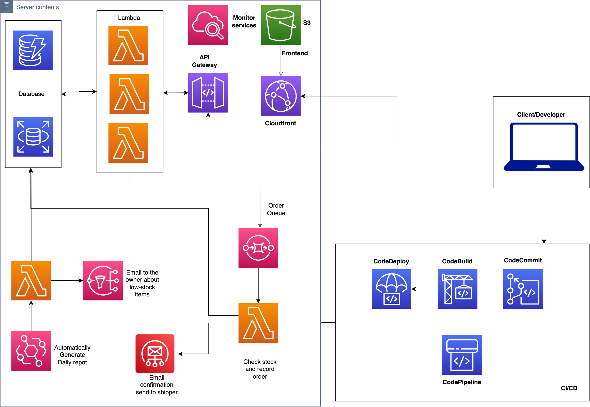

<!-- Improved compatibility of back to top link: See: https://github.com/othneildrew/Best-README-Template/pull/73 -->

<!--
*** Thanks for checking out the Best-README-Template. If you have a suggestion
*** that would make this better, please fork the repo and create a pull request
*** or simply open an issue with the tag "enhancement".
*** Don't forget to give the project a star!
*** Thanks again! Now go create something AMAZING! :D
-->

<!-- PROJECT LOGO -->
 

  <h3 align="center">Serverless Shoe Store</h3>

  

    A serverless project that hosts a functioning shoe website running on AWS platform
  

<!-- ABOUT THE PROJECT -->

## About The Project

- A modern, scalable, and cost-effective solution for an online shoe store using React as the frontend and various AWS services as Backend layer.

- The use of React for the frontend allows for a fast and responsive user interface, while the use of AWS Lambda as the backend enables the website to be fully serverless, meaning it can automatically scale up or down to meet the demand of users without the need for manual intervention.
- Additionally, the use of more than 15 different AWS services in the infrastructure allows for a robust and reliable system that can handle a large volume of traffic and transactions.
- Overall, this website provides a seamless and efficient shopping experience for customers while being able to handle a high volume of traffic and transactions.

### Built With

This section should list any major frameworks/libraries used to bootstrap your project. Leave any add-ons/plugins for the acknowledgements section. Here are a few examples.

- [![React][react.js]][react-url]
- [![Material UI][materialui]][materialui-url]
- [![AWS][aws]][aws-url]

<!-- GETTING STARTED -->

## Getting Started

The project folders (`database`, `frontend`, `lambda`) are splitted by their functionalities. Database folder stores all the SQL commands. Frontend folder stores React application and all Frontend-related code. Lastly, folder lambda stores all the lambda functions.

## High level architecture design

## Features

- View shoe details
- Cart persistence
- Promotion code
- View purchase history
- Place/cancel order
- Email order confirmation
- Admin dashboard to add/update/remove shoes/promocode
- Automatically generate daily sales report
- Automatically email low stock items to admin

<!-- MARKDOWN LINKS & IMAGES -->
<!-- https://www.markdownguide.org/basic-syntax/#reference-style-links -->

[react.js]: https://img.shields.io/badge/React-20232A?style=for-the-badge&logo=react&logoColor=61DAFB
[react-url]: https://reactjs.org/
[materialui]: https://img.shields.io/badge/Material_UI-4834d4?style=for-the-badge&logo=mui&logoColor=white
[materialui-url]: https://mui.com/
[docker.dev]: https://img.shields.io/badge/DOCKER-3498db?style=for-the-badge&logo=docker&logoColor=white
[docker-url]: https://www.docker.com/
[expressjs]: https://img.shields.io/badge/Express-f9ca24?style=for-the-badge&logo=express&logoColor=black
[express-url]: https://expressjs.com/
[postgres-url]: https://www.postgresql.org/
[postgresql]: https://img.shields.io/badge/PostgreSQL-dff9fb?style=for-the-badge&logo=postgresql&logoColor=black
[aws-url]: https://aws.amazon.com/
[aws]: https://img.shields.io/badge/AWS-ef9432?style=for-the-badge&logo=amazonaws
